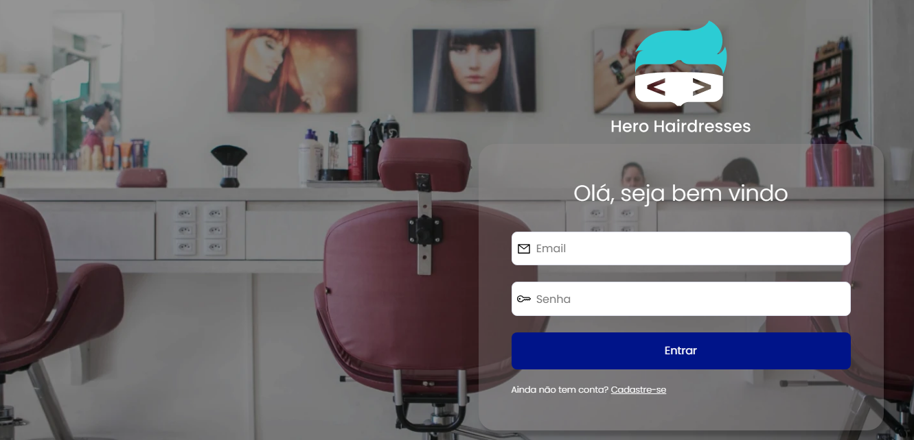
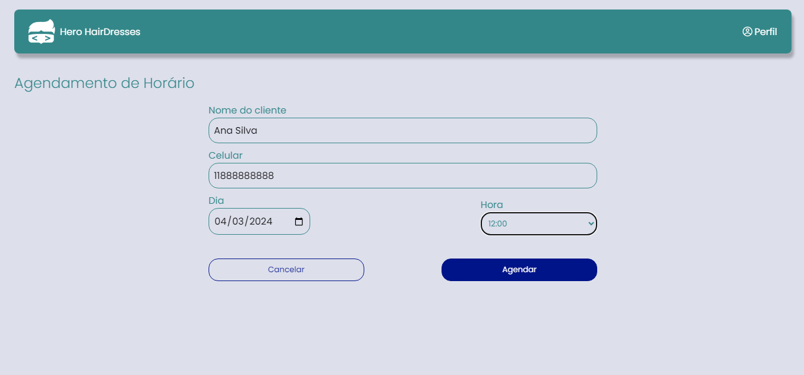
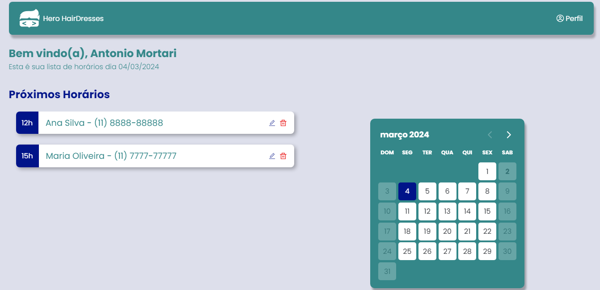
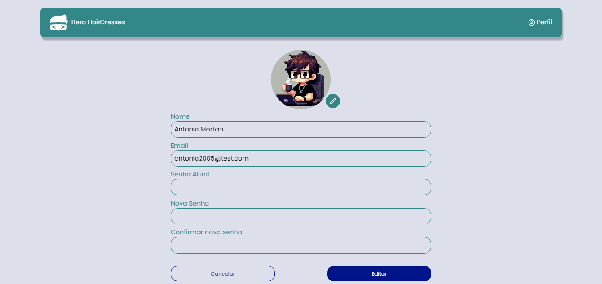

<h1 align="center" style="font-weight: bold;">Hero Hairdresses 💻</h1>

<p align="center">
 <a href="#tech">Tecnologias</a> • 
 <a href="#started">Rodando o projeto localmente</a> • 
  <a href="#api">API</a> •
</p>

<p align="center">
    <b>Este projeto foi desenvolvido durante a Semana do Herói, e consiste em uma aplicação para gerenciamento de agendamentos de um salão de beleza.</b>
</p>

<h2 id="layout">🎨 Layout</h2>

<p align="center" display="flex">
    
    
    
    
</p>

<h2 id="tech">💻 Tecnologias</h2>

- React
- Typescript
- Axios
- React Hook Form
- Yup

<h2 id="started">🚀 Rodando o projeto localmente</h2>
Para rodar o projeto localmente você precisa do Nodejs instalado em sua máquina.

<h3>Clone o repositório</h3>


```bash
git clone https://github.com/AntonioMortari/frontend-hero-hairdresses.git
```

<h3>Instale as dependências</h3>


```bash
cd frontend-hero-hairdresses
yarn install
```
<h3>Inicie a aplicação</h3>

```bash
yarn dev
```

<h2 id="api">🚀 API</h2>

O código-fonte da API Restful deste projeto está localizado em um repositório separado. Você pode encontrá-lo  [aqui](https://github.com/AntonioMortari/api-hero-hairdresses).
